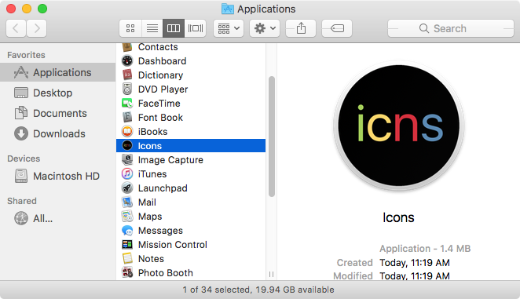
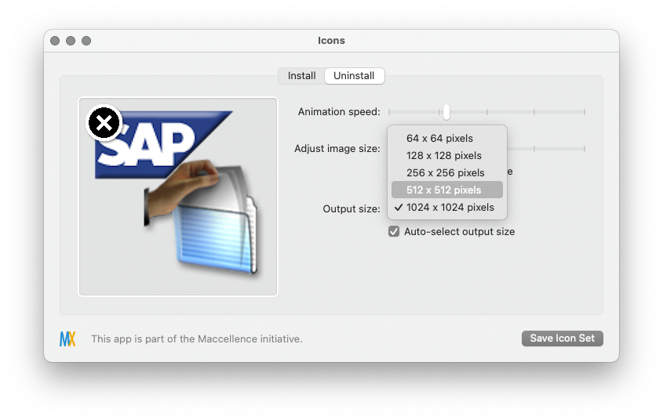
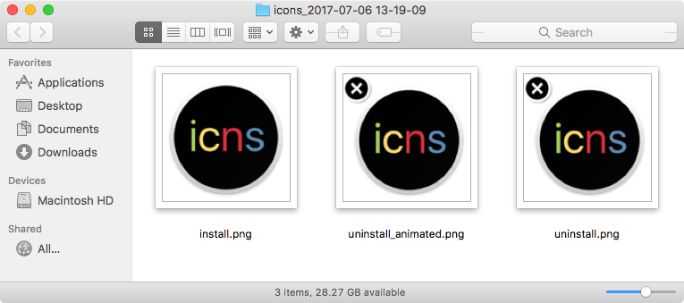

# Icons.app

Description 
===================================

**Icons.app** is an application for macOS which enables you to create graphics files in PNG format, for use with management tools like Jamf Software's Jamf Pro or the open source Munki software installation tool.  

These graphics files may be created from existing applications and will appear similar to the examples shown below.

### **install.png**

### **uninstall.png**

### **uninstall_animated.png**

Installation
===================================

1. Download **Icons.app**.

2. Copy **Icons.app** to to the Applications folder on your Mac.

Using Icons.app
===================================

1. Open the **Icons** application.
2. Drag the desired application into the first of the two panes.

 

3. Set the desired graphics size in pixels.

4. Once the desired graphics size has been set, click the **Save** button.

The **Icons** application will then ask where you want to save the new graphics files to, then create the graphics files.

