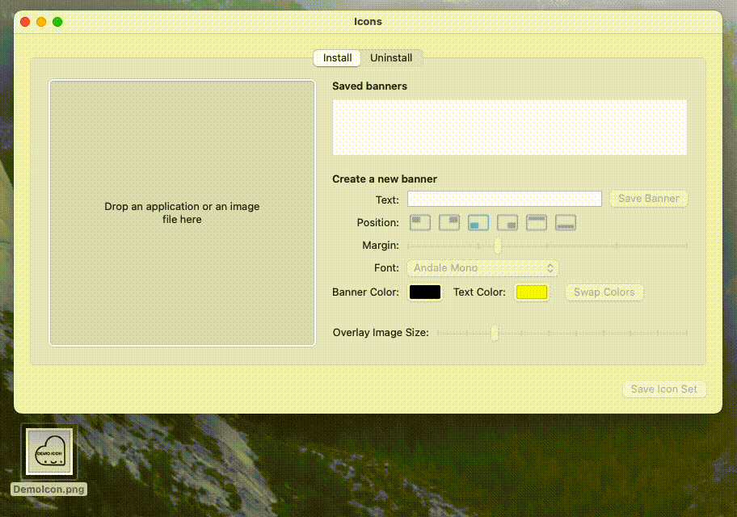

 

 

# Icons

**The easiest way to create customized icons for your app!**

_Icons_ is an application for macOS which enables you to create standardized app icons in PNG format. No graphic skills are needed! Just drag and drop your desired image into the application to create a full icon set, including installer and uninstaller icon, as well as an animated version of the uninstaller icon!

For Mac administrators: When working in multiple environments, e.g. development, test and production environments, the _Icons_ app helps you to keep track of your app versions, by giving the option to add banners to the icons. The _Icons_ can be used for any management tools like Jamf Software's Jamf Pro or the open source _Munki_ software installation tool.

**_Icons_ supports the following macOS versions:**

* macOS 26.x
* macOS 15.x
* macOS 14.x
* macOS 13.x
* macOS 12.x

 

# Features

🌟 Finder extension

🌈 Banner customization

🖱️ Easy drag & drop function

✅ Install and animated uninstall icon

❌ No graphic skills are needed

⌨️ Command line for automatization

 

# Demo

⚡️Have a look at how quick and easy an icon set can be created by drag and drop:

 

# Documentation

If you want to learn more about _Icons_ features, make sure to take a look at our [wiki](https://github.com/SAP/macOS-icon-generator/wiki) or the links below:

* [Install Icons](https://github.com/SAP/macOS-icon-generator/wiki/Installation)
* [Uninstall Icons](https://github.com/SAP/macOS-icon-generator/wiki/Uninstallation)
* [Using Icons](https://github.com/SAP/macOS-icon-generator/wiki/Using-Icons)
* [FAQ](https://github.com/SAP/macOS-icon-generator/wiki/Frequently-Asked-Questions)

 

# Example

Here you can find an example how the icon set could look like. The icon set contains the following files. First image shows `install.png`, the second image shows the `uninstall.png` and the third is the `uninstall_animated.png` animated. All images are saved in PNG format.

 

 

 

# License

Copyright (c) 2022-2025 SAP SE or an SAP affiliate company and Icons contributors. Please see our [LICENSE](https://github.com/SAP/macOS-icon-generator/blob/main/LICENSE) for copyright and license information. Detailed information including third-party components and their licensing/copyright information is available via the [REUSE](https://api.reuse.software/info/github.com/SAP/macOS-icon-generator) tool.

 

# Security
Found a security-related issue or vulnerability and want to notify us? [Please see here for how to report it](https://github.com/SAP/macOS-icon-generator/security/policy).

 

# Support

This project is 'as-is' with no support, no changes being made. You are welcome to make changes to improve it but we are not available for questions or support of any kind.
